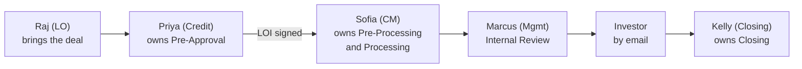

# The whole project in plain English

**What this is.** Monacle OS explained from scratch, for anyone who has not sat
in the discovery calls — no lending background assumed. Every permutation and
every fork in the flowchart is walked through with a named person and a real
situation, so the rules can be checked against how the work actually happens.

**What this is not.** A new source. Everything here is derived from
[`00-what-we-are-building.md`](00-what-we-are-building.md),
[`02-the-flowchart.md`](02-the-flowchart.md), [`03-scope.md`](03-scope.md),
[`05-roles.md`](05-roles.md), [`06-communications.md`](06-communications.md) and
the client's own material in [`client-inputs/`](client-inputs/). Where those
differ, they win.

**The cast is fictional.** Raj, Priya, Sofia and the rest are invented so one
team can carry every example. The roles they hold, and everything they do, are
the real ones.

---

## Contents

1. [What is Monacle OS?](#1--what-is-monacle-os)
2. [Who is involved: the cast](#2--who-is-involved-the-cast)
3. [The main flow, start to finish: Tom's loan](#3--the-main-flow-start-to-finish-toms-loan)
4. [Every permutation, one by one, with a real-life example](#4--every-permutation-one-by-one-with-a-real-life-example)
5. [Key terms in simple words](#5--key-terms-in-simple-words)
6. [What is still open, and what we assumed meanwhile](#6--what-is-still-open-and-what-we-assumed-meanwhile)

---

## 1 · What is Monacle OS?

Monacle OS is the software Spreo Capital will use to run every loan, from the day
a salesperson brings in a deal to the day the money is wired. In the discovery
folder it is also called **Spreo OS**; both names mean the same product.

**Who is Spreo Capital?** A private real-estate lender. They lend to property
investors: people who buy a run-down house, fix it and sell it, people who build
from the ground up, and people who buy rental buildings. These are business
loans, not ordinary home mortgages. The money itself comes from bigger **capital
partners** — Fortress, SCIF, Churchill — so every loan needs their approval too.

**What is broken today.** The team runs on LendingWise (an old loan system), a
spreadsheet called Pulse, and Outlook. Three problems keep coming up:

- LendingWise shows everyone every field, so nobody fills anything in.
- Staff have to remember which documents to ask each borrower for. Dan:
  *"I rely on my team having to remember to ask. And guess what? They forget.
  Always."*
- Nobody can see where a loan is stuck, or who has been sitting on it for how
  long.

**The simple picture.** Think of a parcel-tracking screen at a courier company.
Every loan is a parcel. The screen shows which station it is at, who is holding
it, how many days it has been there, and what is still missing before it can move
to the next station. Monacle OS is that screen, plus the tools each station needs
to do its job.

### The seven jobs it does

| # | Job | In plain words |
|---|---|---|
| 1 | **Pipeline (Pulse)** | One screen with every live loan, its stage, and days in status. What the owner runs the business from |
| 2 | **The loan record** | One file per loan, eleven tabs. Each person sees only the fields their role needs, at the stage the loan has reached |
| 3 | **The Needs List** | The system writes the document checklist for each loan automatically, from the loan's own characteristics — see §4 |
| 4 | **Document management** | One slot per document. Three review layers. Nothing is ever deleted |
| 5 | **LOI generation** | One action builds the Letter of Intent package as a single PDF |
| 6 | **Emails** | 31 named templates, sent as the person through Outlook, replies recorded by hand. Plus an automatic Mon/Wed/Fri "still outstanding" email to the borrower |
| 7 | **Loan documents and reports** | Final papers through Lightning Docs, a closing checklist, and five reports |

### What it deliberately does not do in Phase 1

| Not included | Why |
|---|---|
| Due dates, deadlines, SLAs, "overdue" | Dan: *"there's really no SLAs. Everything is as soon as possible."* Days in status is the only clock |
| AI of any kind | Phase 2 |
| Text messaging | *"If somebody texts, they expect to text back, not email back"* |
| A workflow builder or admin console | The process is fixed and built for Spreo. Later phase |
| Reading anyone's mailbox | The platform sends; a person records what came back |
| A direct connection to any AMC, or to Setpoint | Email only. Staff type the status in by hand |
| Loan sizing and stress-test maths | Credit does this offline before the platform starts |

### The three tests

Anything proposed for Phase 1 must pass one of them:

1. Does it make the process visible?
2. Does it get documents in faster, or with less client friction?
3. Does it let the pipeline be managed in one place?

**The vocabulary is the client's, exactly.** Repeat Borrower, UW Material, Pulse,
Needs List, Kick-off Email, No Fly List, Scrub, Feasibility, Track Record, VOM,
Payoff, AMC. Those words are on screen and in the code because the team already
speaks them.

---

## 2 · Who is involved: the cast

Eleven roles inside Spreo, and eight kinds of outside party who never log in. In
real life the owner, Dan Frankel, plays the Management role, and one person can
hold more than one role.

### Inside Spreo — they log in

| Example person | Role | What they do, in one line | Their big moment |
|---|---|---|---|
| **Raj** | Loan Officer (LO) | The salesperson. Brings the deal in, creates the loan with five fields, stays copied throughout, approves the final structure | Emails the deal to `submissions@` |
| **Priya** | Credit | Decides whether Spreo lends and on what terms. Owns everything up to the signed LOI. The only role that can ever remove a Needs List item | Picks the permutations, generates the LOI |
| **Marcus** | Management / Internal Underwriter | Approves the internal pre-approval, reviews the whole file by exception, can override a No Fly match or the Processing gate with a recorded reason | Says yes or no |
| **Lena** | Client Management Team Lead | Assigns the client manager once the LOI is signed | Hands the loan to Sofia |
| **Sofia** | Client Manager (CM) | Owns the loan from signed LOI to investor approval. Sends the kick-off, chases documents, reviews files, keeps vendors moving, clears findings | Sends the Kick-off Email |
| **Omar** | Construction Management | Approves budget and appraisal on renovation and construction loans, alongside Credit | Signs off the budget |
| **Nadia** | Appraisal Manager | Runs the appraisal process | Marks the appraisal Final |
| **Kelly** | Closing | Fills the loan-document fields, generates papers through Lightning Docs, sends them to escrow, records the wire and funding date | Wires the money |
| **Ana** | Admin | Everything, plus the No Fly lists | Loads Churchill's list |
| **Setpoint** (a firm) | Third-Party Review | An outside firm, or the offshore team, re-checks every document and records a decision per file | Clears a document for good |
| **Marcus again** | Internal Pre-Approval Reviewer | The same person, different hat, at the very start | Clicks Approve in the email |

### Outside Spreo — they never log in

| Example | Who they are | How they touch the loan |
|---|---|---|
| **Tom** | Guarantor 1, the main borrower | Signs the LOI, gets the Needs List and the recurring email, uploads through a personal link, signs application and disclosures on DocuSign, approves the final structure |
| **Maria** | Guarantor 2 | Signs her own short authorization, application and driver's licence. Her own portal link. Never sees Tom's items |
| **Tom & Maria Holdings LLC** | The borrowing entity | The company that actually borrows. Never an individual |
| **Ben** | Broker | Brought the deal instead of Tom coming direct. Copied on the borrower emails; eight fields captured about him |
| **Fortress / SCIF / Churchill** | Capital partner (investor) | Pre-approves and finally approves by email; staff record the reply on their behalf. Churchill also supplies a No Fly list |
| **Mr. Patel at ValueRight AMC** | Appraiser / AMC | Receives the order and the trigger emails, sends the invoice and the report |
| **Build Analysis Co.** | Budget vendor | Receives the Construction Order, inspects the site, delivers the Scrub or Feasibility |
| **Title · Escrow · Legal · Flood · Loan servicer** | Closing-side vendors | Receive kick-off emails; Title returns the closing statement; Escrow receives the loan documents; the servicer receives the tape after funding |

### Four rules the system enforces, not just displays

1. **Only Priya (Credit) can remove a Needs List item.** Sofia must email her —
   there is deliberately no button. Dan: *"I don't want a button… it's
   distracting."*
2. **Nothing approves in review while a finding is open.**
3. **The gate into Processing** — four conditions, all objective (§3).
4. **A No Fly match blocks LOI generation** until Marcus records an override with
   a reason.

### Who owns the loan, when

The loan changes hands at the signed LOI, again when it goes up for review, and
again when the investor says yes.

---

## 3 · The main flow, start to finish: Tom's loan

One loan, six stages, about 31 emails, one hard gate.

**The deal.** Tom wants to buy a run-down duplex at 42 Peach Street, Atlanta,
Georgia for $400,000, gut-renovate it, add a bedroom, and sell it. His business
partner Maria will guarantee it with him. The deal came through broker Ben. Spreo
will fund it with Fortress money. This one loan touches most of the permutations
in §4 on purpose.

Credit owns Stage 1, Client Management Stages 2 and 3, Management Stage 4, the
investor decides Stage 5, Closing owns Stage 6. On-Hold can be set from any stage.

### Stage 0 · The deal arrives — outside the system

Raj emails Credit at `submissions@` with the numbers, a short write-up and a
rough valuation. This happens in Outlook. The platform does not capture it, on
purpose.

### Stage 1 · Pre-Approval — Priya (Credit)

**Statuses:** Credit Review → Pre-Approval Requested → Pre-Approved → LOI Out →
LOI Signed. Or **Not Pre-Approved**, which ends it.

1. **Raj creates the loan** with five fields: address, Purchase or Refi,
   Portfolio Refi Y/N, Repeat Borrower Y/N, approximate amount. Status: Credit
   Review.
2. **Priya works out the structure** — loan amount, rate, term — offline. The
   platform does not do this maths.
3. **Priya sets the Capital Source to Fortress.** The investor has to be known
   before the platform can address them.
4. **Priya sends the Internal Pre-Approval Request to Marcus.** Subject merged
   ("Pre-Approval Request: 42 Peach Street"); she types the body herself, because
   every deal is different. Marcus clicks Approve in the email, or replies, and
   Priya records the outcome.
5. **Priya sends the Investor Pre-Approval Request to Fortress.** Same shape.
   Fortress replies by email; Priya records Pre-Approved. Had Fortress declined,
   the loan would end here.
6. **Priya emails Raj "Loan Pre-Approved"** with the approved terms.
7. **Priya enters the loan's data** — Tom and Maria as guarantors, the LLC, the
   property, the terms, and the permutations (Purchase · Broker · 2 guarantors ·
   Heavy Reno · Adding SF · 2-4 Unit · Fortress). About forty fields. **As each
   guarantor name is typed the No Fly check runs** against Churchill's list and
   Spreo's own. No match, so nothing is blocked.
8. **Saving the permutations builds the Needs List.** Priya reads it, adds one
   special item, removes one with a reason. Removed items go to a drawer; nothing
   is deleted.
9. **Priya generates the LOI package** — one PDF, four parts: the letter, the
   liquidity requirement, the authorization, the checklist. Maria, as Guarantor
   2, gets her own short authorization.
10. **One Send.** In a single screen Priya sends the LOI to Tom by DocuSign (Ben
    and Raj copied), orders the appraisal from ValueRight AMC, and — because this
    is a Heavy Reno — orders the budget review from Build Analysis Co. with Raj
    **bcc**, the only bcc in the platform. Status: LOI Out.
11. **The AMC invoices.** Priya forwards the invoice link to Client Management
    and Raj — not to Tom yet.
12. **Tom signs on DocuSign.** Recorded. Status: LOI Signed.
13. **Priya sends the Hand-off** to Client Management. From here she is
    read-only — except that removing a Needs List item stays hers for the life of
    the loan.

### Stage 2 · Pre-Processing — Sofia (Client Manager)

The first time Tom hears from Spreo about documents.

1. **Lena assigns Sofia.** Status: Pre-Processing.
2. **Sofia sends the appraisal invoice to Tom**, Raj copied. Appraisal status:
   Invoice Sent.
3. **Sofia orders Title and Escrow.** The property is in Georgia — an attorney
   state — so she also sends the **Legal Kick-off** to counsel. In Texas she
   would skip this.
4. **As each signed authorization returns, Spreo pulls credit, background, PACER
   and UCC** on that guarantor. Internal items; the borrower never sees them.
   Anything they turn up becomes a follow-up question under that guarantor.
   Middle FICO is recorded.
5. **Sofia tailors the Needs List.** Tom borrowed from Spreo two years ago, so
   his driver's licence is carried over from that loan — it still runs the whole
   review path. She adds a follow-up question. She cannot remove anything; for
   that she emails Priya.
6. **Sofia sends the Kick-off Email** to Ben, Tom and Maria, Raj copied. The
   tailored list travels *in the email*, plus a personal portal link for Tom and
   another for Maria. **This is the moment the borrower's view switches on.**
7. **Sofia sends the Application** to Tom and Maria and the **Disclosures** to
   Tom only, both by DocuSign.
8. **Tom's list of past projects arrives.** Track record: Initial.
9. **The recurring Needs List email starts** — Mon/Wed/Fri 8am, everything
   outstanding in one message. No due dates. Items drop off when done.

**The gate into Processing.** The platform refuses to advance until all four are
true, and names what is unmet:

| # | Condition | Tom's loan |
|---|---|---|
| 1 | Appraisal **paid** | Tom paid on day 3 |
| 2 | Escrow contact provided — **purchase only** | Ben sent it on day 4 |
| 3 | **Every** guarantor authorization signed and received | Maria signed on day 6 |
| 4 | Track record at **Initial** | List arrived on day 5 |

On day 6 the loan moves to Processing. Marcus could have overridden the gate
earlier — the override would be recorded with his name and reason. Dan's reason
for the gate: *"you're in pre-processing. You've been in pre-processing for 14
days. The onus is on you."*

### Stage 3 · Processing — Sofia, with Priya and Omar on approvals

1. **Documents arrive and are checked in three layers.** Tom uploads a bank
   statement; it is auto-marked Received; Sofia reviews it (Approve · Reject ·
   Need Additional, always with a note); then it goes to Setpoint. It leaves
   Sofia's attention only when **Setpoint** clears it.
2. **The appraisal runs its course** — Paid, inspection scheduled, inspection
   occurred, Received, Under Review, Final. Nadia chases Mr. Patel; trigger
   emails also nudge him, for example 48 hours before promised delivery.
3. **The budget review runs alongside.** Build Analysis Co. makes its own site
   visit — separate from the appraiser's — delivers the Feasibility, Omar and
   Priya approve it, and it is sent to the appraiser.
4. **Sofia builds the track record to Complete**, connecting every past address
   to Tom or Maria.
5. **Priya finalises the loan structure** from the real numbers: appraised value,
   approved budget, actual FICO.
6. **Priya asks Raj to approve the final structure** (internal), then **Sofia
   asks Tom and Ben** (external).
7. **Sofia sends the Setpoint Request** — Fortress loans go through Setpoint.
8. **Sofia sends the Internal Final Approval** to Marcus with the Loan Summary,
   the files and Setpoint's findings.

### Stage 4 · Internal Review — Marcus

Marcus reviews **by exception**: a numbered list of what is wrong with the loan,
not a tick against every document. Dan: *"Do it more on an exception basis
instead of an approval basis."* Say he raises two findings. Status: Items
Requested. The findings go to Sofia and the working group — **never to Tom**.
Sofia clears each one with a note. Status: back to In Review. When no finding is
open, Marcus approves.

Every leg — in, out, back in, approved — is stamped separately, so later anyone
can answer *"why did it take five days?"* with *"it only took me a day, it took
you four."*

### Stage 5 · Investor Review — Fortress, by email

Because the capital source is Fortress, **a principal (Marcus) sends the Final
Approval request**, not Sofia. For Churchill or SCIF, Sofia would send it.
Fortress reads the package and the seven-column investor tape in email — they
never log in. They reply "Conditionally Approved" with one condition; Sofia
records it. Sofia then sends **Approved Terms** to Raj and to Kelly.

### Stage 6 · Closing and Funding — Kelly

**Statuses:** Approved → Docs Out → Docs Signed → Cleared to Close → Funded →
Post Funding → Closed.

1. Kelly fills the closing fields — funding entity, signatories, lien position,
   MERS ID, escrows, governing law, and the rest.
2. The platform merges everything into the Lightning Docs field set, shows it to
   her, then generates the loan documents. It refuses if Fortress has not
   approved or a required field is empty.
3. Kelly QCs the papers and sends them to Escrow. Docs Out.
4. Tom and Maria sign at escrow. The signed PDF returns and is checked for
   missing signatures and initials. Docs Signed.
5. **Eight standard closing items** are requested from Title and Escrow and
   tracked exactly like a Needs List — settlement statement, first-lien
   confirmation, signed lender instructions, escrow lender confirmation,
   recording package, ALTA 32.2/33 mechanics lien coverage, title commitment
   supplement, closing protection letter.
6. Kelly verifies the title company's wire instructions **verbally**, then
   confirms to Marcus by email. Cleared to Close.
7. The wire goes out. Funded. Kelly records the wire reference and funding date,
   and the **servicing tape** generates — it cannot be produced before Funded.
8. After funding: the release of mortgage or assignment for recording arrives,
   and the final settlement statement from escrow. Post-closing documents are
   saved in LendingWise. Closed.

### Across every stage · On-Hold

If Tom's seller walks away for a month, anyone can put the loan On-Hold. It keeps
its stage and status underneath and sits rightmost on the pipeline. Only Priya
(Credit) or Marcus (Management) can release it.

### What the platform records the whole way

Every status change — what, when, who, what caused it. Every email — template
version, recipients, sender, time. Every document event — upload, replace, each
review decision with its note. Every override. **Days in status** is computed
from the latest stamp and is the only timing signal in the platform.

---

## 4 · Every permutation, one by one, with a real-life example

A **permutation** is a dial Priya sets on the loan. Seven dials decide which
documents go on the Needs List, which emails fire, and which fields appear. This
is the only genuinely dynamic thing in Phase 1. After the dials come the other
forks in the flowchart — the diamond-shaped decisions.

### The standard Needs List — on every loan, whatever the dials

| For each guarantor | For the borrowing entity | For the loan |
|---|---|---|
| Copy of driver's licence | Last 2 months of consecutive entity bank statements | Signed federal disclosures (DocuSign, Guarantor 1) |
| Application (DocuSign) | Operating agreement | Track record — the form depends on loan type, dial 5 |
| Authorization — one in the LOI packet, one sent separately | | |
| Last 2 months of consecutive personal bank statements | | |
| Schedule of real estate | | |

Plus **internal items** Spreo pulls itself and the borrower never sees: credit
report, background check, PACER, UCC search, sponsor search, org chart, and on a
refinance the VOM and Payoff.

The dials below **add** to this list. They never take away from it.

### Dial 1 · Purchase or Refinance — the transaction type

| Setting | What it adds | What else changes |
|---|---|---|
| **Purchase** | PSA · escrow contact information | "Escrow contact provided" becomes gate condition 2. The authorization asks for escrow details and says nothing about a payoff |
| **Refinance** — cash-out or no-cash-out | VOM · Payoff · latest mortgage statement | The authorization also lets the current lender release the Payoff and VOM. Sofia sends the VOM and Payoff request to that lender. The AIV field appears |
| **Mid-construction refinance** — add-on | Last inspection report from the previous lender · spend-to-date | Priya also sends a Construction Order at One Send. The Weather Tight field appears |
| **Portfolio Refinance** — add-on | Nothing extra yet — open question | Spreo already holds the loan being refinanced, so much of the file is on hand |

**Purchase, real life.** Tom is buying 42 Peach Street from a seller. Priya sets
Purchase. The Needs List gains PSA and escrow contact. Ben sends the escrow
officer's details on day 4, ticking gate condition 2. Nobody asks Tom for a
payoff letter — there is no old loan to pay off.

**Refinance, real life.** Aisha owns a rental fourplex in Phoenix with a loan
from Lender X. She wants a bigger Spreo loan and cash out. Priya sets Cash-out
Refi. The Needs List gains VOM, Payoff and latest mortgage statement. Aisha signs
the authorization, which now includes a line letting Lender X talk to Spreo.
Sofia emails Lender X for the payoff figure and the VOM — the private report card
on how Aisha paid. No PSA, no escrow contact, and gate condition 2 does not apply
to her.

**Mid-construction refinance, real life.** Carlos is halfway through building a
house and his first lender has stopped funding draws. Priya sets Refinance plus
Mid Construction. The Needs List gains the previous lender's last inspection
report and spend-to-date, so Spreo can see how much is built and how much was
spent. Because it is construction, Build Analysis Co. is also ordered at One
Send.

### Dial 2 · Direct or Broker — the channel

| Setting | What it adds | What else changes |
|---|---|---|
| **Direct** | Nothing | Emails go to the guarantors only |
| **Broker** | Broker agreement, plus eight captured fields: name, company, email, phone, licence type, licence number, origination fee %, processing fee $ | The broker is copied on every borrower email — LOI, Pre-Processing, Kick-off, recurring Needs List, structure approval. The broker may carry the additional guarantors' authorizations. Broker licence and address flow into the closing documents |
| **Repeat Broker** — add-on | Nothing extra yet — open question | A flag for reporting |

**Broker, real life.** Ben found Tom and brought the deal to Raj. Priya sets
Broker and types Ben's eight details, including his 1% origination fee. From then
on Ben is automatically on the cc line of every email to Tom, so he can chase Tom
for documents. When Maria's short authorization is needed, Ben can collect it. At
closing, Ben's licence number prints on the loan documents without anyone
retyping it.

**Direct, real life.** Dev walked into Spreo's office after a referral. Priya
sets Direct. No broker fields, no extra cc, no broker fee line on the LOI.

### Dial 3 · One guarantor, or more than one

| Setting | What it adds | What else changes |
|---|---|---|
| **One guarantor** | Nothing | Guarantor 1 signs the full LOI packet |
| **More than one** | For each additional guarantor: signed authorization · driver's licence · completed application · schedule of real estate | Each additional guarantor gets a separate short authorization — identity and credit only, no payoff, VOM or escrow language — as its own page. Each gets their own portal link and sees only their own items. Gate condition 3 waits for **all** authorizations. A guarantor added later gets only their own documents, not the whole list again |
| **Repeat Borrower** — add-on | Nothing added; things are **carried over** | The guarantor is matched by email to earlier loans; a match offers what Spreo already holds. Taking one satisfies the submission only — the file still runs the whole review path |
| **Guarantor Exposure** — add-on | Nothing | Captured on a repeat guarantor: how much Spreo already has out to this person |

**More than one guarantor, real life.** Tom and Maria both guarantee. Priya sets
2 guarantors. The Needs List gains a second set of four items with Maria's name
on them. Maria receives her own short authorization from Ben, her own Application
via DocuSign, and her own portal link. When she opens it she sees only her own
four items — never Tom's. The loan cannot leave Pre-Processing until both
authorizations are back. If a third partner, Ravi, joins in Processing, only
Ravi's four items are added.

**Repeat Borrower, real life.** Tom borrowed from Spreo in 2024. When Sofia
tailors the list the system shows *"Driver's licence: on file from loan 2024-031"*.
She carries it across. Tom's list shows it as Under Review rather than
Outstanding, so he is not asked twice. Sofia and Setpoint still review it.

### Dial 4 · Property type, and its add-ons

| Setting | What it adds | What else changes |
|---|---|---|
| **SFR · 2-4 Unit · MFR · Condo · Townhouse** | Nothing by itself | Captured for reporting and the LOI text. Three competing lists are in play — open question |
| **Adding SF** — add-on | Plans | Open question: should Heavy Reno and GUC also require plans? |
| **Lot Split · Condo Map · ADUs** — add-ons | Nothing yet — open question | Captured as Y/N |

**Adding SF, real life.** Tom's duplex gets a bedroom built onto the back. Priya
ticks Adding SF. "Plans" appears on the Needs List, so the architect's drawings
are requested up front and the appraiser can value the larger house.

**ADUs, real life.** Grace is adding a small rental unit in her backyard. Priya
ticks ADUs. Today this only records the fact; Dan still has to say whether it
should add a document.

### Dial 5 · Loan type

| Setting | What it adds | What else changes |
|---|---|---|
| **Bridge** | Nothing extra. Track record = properties stabilized or sold in the past 36 months | A short loan, no construction, no budget vendor |
| **Light Reno · Heavy Reno · GUC** | Draft budget · budget review (Scrub or Feasibility) · construction inspection. Track record = the same 36-month list | Priya sends a **Construction Order** at One Send. Omar approves budget and appraisal. ARV and budget fields appear. The appraisal can sit at Approved Pending Budget |
| **DSCR** — a rental loan | Subject property leases. Track record = 24 months of real-estate investment experience, including leases | Rent-based underwriting. No budget vendor |
| **Mid Construction** — add-on | The previous lender's draw report | See dial 1 |
| **Weather Tight** — add-on | Nothing yet | Captured only on mid-construction: is the shell closed against rain? |

The first four — Bridge, Light, Heavy, GUC — are **RTL** loans. The track record
question splits on this: RTL asks *"what have you flipped or sold in three
years?"*; DSCR asks *"how long have you been a landlord, and show me the
leases."*

**Bridge, real life.** Dev bought a house at auction and needs six months of
money before reselling. No work planned. Priya sets Bridge. No budget items, no
Construction Order, no Omar. Dev's track record is three houses sold since 2023.

**Heavy Reno, real life.** Tom's duplex gets a full gut. Priya sets Heavy Reno
and picks Feasibility, the heavier review. Three items appear: draft budget,
budget review, construction inspection. At One Send, Build Analysis Co. receives
the Construction Order with Raj bcc'd. Tom sends them his contractor's budget.
They inspect the site — a separate visit from the appraiser's. Their Feasibility
returns, Omar and Priya approve it, and only then can the appraisal move from
Approved Pending Budget to Final.

**Light Reno, real life.** Sam is repainting and fitting a new kitchen in a
rental. Same three items as Tom, but Priya picks Scrub, the lighter review,
because the budget is small.

**GUC, real life.** Grace owns an empty lot and wants to build from scratch.
Priya sets GUC. The same three budget items, plus plans if Adding SF is also
ticked — Dan has been asked whether GUC should always need plans.

**DSCR, real life.** Aisha's Phoenix fourplex is fully rented. Priya sets DSCR.
The Needs List gains subject property leases — all four tenants'. Her track
record item reads *24 months of investment experience, including leases*, not a
list of sales. No budget vendor is ordered.

### Dial 6 · Capital source

| Setting | What it changes |
|---|---|
| **Any partner** | Who the Investor Pre-Approval and Final Approval emails go to. The partner's own additional document items join the Needs List — contents not yet supplied. Only Credit or Management may change this field |
| **Fortress** | A **principal** sends the Final Approval request, not the CM. The file goes to Setpoint |
| **SCIF** | The CM sends the Final Approval request. Setpoint may apply — open question |
| **Churchill** | The CM sends the Final Approval request. Churchill also supplies one of the two No Fly lists |
| **Global Required** — add-on | Personal tax returns and investment statements are added. Used when the borrower's total exposure is large |

**Fortress, real life.** Tom's loan is Fortress money. In Stage 5 the platform
puts Marcus's name on the Final Approval email, and Sofia had already sent the
Setpoint Request in Stage 3.

**Churchill, real life.** Dev's bridge loan is Churchill money. Sofia sends the
Final Approval herself. Back in Stage 1, when Priya typed Dev's name, the No Fly
check also looked in Churchill's list.

**Global Required, real life.** "Big Mike" already has $8 million of Spreo loans
across five projects. On his sixth, Priya ticks Global Required. His Needs List
gains two years of personal tax returns and his investment account statements, so
Spreo can see the whole picture.

### Dial 7 · Is the property in an attorney state?

| Setting | What it changes |
|---|---|
| **Attorney state** — AL, CT, DE, FL, GA, KY, LA, ME, MA, MD, MS, NH, NY, NC, ND, RI, SC, VT, WV | Sofia sends a **Legal Kick-off** to a law firm, with wording that varies by state. The legal contact block appears on Contacts |
| **Any other state** | No Legal Kick-off |

**Real life.** Tom's duplex is in Georgia, so Sofia's task list shows *Legal
Kick-off (Georgia)* and the email uses the Georgia wording. Dev's house is in
Texas, so that task never appears.

### Putting the dials together — four example loans

| | **Tom** | **Aisha** | **Dev** | **Carlos** |
|---|---|---|---|---|
| Transaction | Purchase | Cash-out Refi | Purchase | Refi · Mid Construction |
| Channel | Broker (Ben) | Direct | Direct | Broker |
| Guarantors | 2 — Tom, Maria | 1 | 1 | 1 · Repeat Borrower |
| Property | 2-4 Unit · Adding SF | MFR | SFR | SFR |
| Loan type | Heavy Reno | DSCR | Bridge | GUC |
| Capital source | Fortress | Churchill | Churchill | SCIF · Global Required |
| State | Georgia — attorney | Arizona | Texas | New York — attorney |
| **Extra items beyond the standard list** | PSA · escrow contact · broker agreement · Maria's four items · plans · draft budget · budget review · construction inspection · Fortress items | VOM · payoff · mortgage statement · leases · Churchill items | Nothing extra | VOM · payoff · mortgage statement · last inspection report · spend to date · broker agreement · draft budget · budget review · construction inspection · tax returns · investment statements · SCIF items |
| **Extra emails** | Construction Order · Legal Kick-off · Setpoint Request; a principal sends Final Approval | VOM and Payoff request | None | Construction Order · VOM and Payoff request · Legal Kick-off |
| **Track record asks for** | Sold or stabilized in 36 months | 24 months as a landlord, with leases | Sold or stabilized in 36 months | Sold or stabilized in 36 months, carried over from his last loan |

**If a dial changes later, the list rebuilds safely.** Say Tom's plan changes from
Heavy Reno to Bridge in Processing. The three budget items retire only if nothing
has been uploaded against them. Anything already submitted stays. Items Sofia
added by hand never retire.

### The other forks in the flowchart

The diamond-shaped decisions that are not Needs List dials. Each is a place where
the loan can go two ways.

| # | The fork | Path A | Path B | Real-life example |
|---|---|---|---|---|
| F1 | **No Fly match?** — Stage 1, as each guarantor name is typed | No match: carry on | Match: red banner, pop-up on opening the record, LOI generation **blocked**. Management can override with a recorded reason; otherwise the loan stops | Priya types "Maria Lopez". A Maria Lopez is on Churchill's list. Banner appears. Priya checks — different date of birth. Marcus records *"Different person, DOB verified"* and the LOI unblocks. The name stays on the list |
| F2 | **Internal pre-approval?** | Yes: Internal Approved, on to the investor | No: back to Priya to rework | Marcus replies *"rate too low for this risk"*. Priya reprices and resends. Both legs stamped |
| F3 | **Investor pre-approves?** | Yes: Pre-Approved | No: **Not Pre-Approved — the loan ends.** Open question: can it come back with a different partner? | Fortress passes on Carlos's half-built house. Today the loan is dead in the platform |
| F4 | **How is the LOI delivered?** | DocuSign envelope; signing status returns automatically per guarantor | PDF by hand; Priya marks sent, then marks signed with who and when | Tom signs on DocuSign. Big Mike prints, signs and emails a scan; Priya marks it by hand |
| F5 | **Construction Order at One Send?** | Light Reno, Heavy Reno, GUC or mid-construction refi: yes, to the budget vendor, LO bcc | Bridge or DSCR: no | Tom yes, Dev no |
| F6 | **Where does the Hand-off happen?** | At LOI Signed — what the flowchart shows | At LOI Issued — open question | Today Sofia is assigned only after Tom signs |
| F7 | **All four gate conditions true?** | Yes: Processing | No: refused, naming what is unmet. Management can override with a recorded reason | Maria's authorization is missing. The screen says *1 of 2 authorizations signed*. Sofia calls Ben |
| F8 | **Repeat Borrower with documents on file?** | Yes: Sofia carries them over — satisfies submission, still reviewed | No: everything requested fresh | Tom's licence carried over; Maria's requested new |
| F9 | **How does a file arrive?** | The borrower uploads through their portal link | Staff upload on their behalf — recorded as acting-for — or file an email reply's attachment, or carry it over from a prior loan | Tom uses the link. Maria emails a photo of her licence; Sofia files it and the platform records *uploaded by Sofia for Maria* |
| F10 | **Sofia's review decision** — always with a note | Approved: on to third-party review | Rejected — borrower sees *Resubmission needed* — or Need Additional: a follow-up question attaches under the item and the borrower sees *More information needed* in plain words | Tom's bank statement is missing page 3. Sofia picks Need Additional: *"Please send page 3 of the July statement."* That question appears under the item on Tom's list |
| F11 | **How does an approved item travel to third-party review?** | Immediately, on its own | Waits for its whole **package** and travels with it. Set per item | The appraisal goes alone the moment it is approved. Tom's five sponsor documents wait and go as one bundle |
| F12 | **Who asked for the resubmission?** | Spreo or third-party review asked: the new file runs the gates again | The **underwriter** asked: it goes straight back to the underwriter, skipping both layers, because by then the loan is in a sprint | In Internal Review, Marcus asks for a newer bank statement. Tom uploads it; it lands on Marcus's desk, not Sofia's |
| F13 | **Appraisal value accepted?** | Yes: Final — or Approved Pending Budget while the budget is open | No: **Challenged**, the order stays open, back to Under Review | Mr. Patel values Tom's duplex $60k below contract. Nadia challenges with comparable sales. The order stays open until it is resolved |
| F14 | **Track record: how is an address connected to the guarantor?** | The guarantor's signature is on the title or loan document: save it | Not there: check the Secretary of State register; still not there: ask the client for an operating agreement, a lease or rent roll, or a JV agreement | Tom's 2023 flip was held in *TM Ventures LLC*. Sofia finds Tom as manager on the state register and saves the PDF |
| F15 | **LO approves the final structure? Then the client?** | Yes and yes: structure locked, on to Setpoint and internal review | Either says no: back to Priya to revise | The appraisal came in low, so the loan amount drops. Tom pushes back; Priya reworks the holdback and Tom accepts |
| F16 | **Does the underwriter have findings?** | None open: Approved | Findings: Items Requested; the numbered list emails to the CM and the working group — never to the client; each cleared with a note; back to In Review | Finding 1: *"Explain the $40k deposit in June."* Sofia requests a Letter of Explanation, attaches it, notes *LOE received — sale of car*, and the finding closes |
| F17 | **Who sends the Final Approval to the investor?** | Churchill or SCIF: Client Management | Fortress: a principal. Set per partner as configuration, not code | Tom (Fortress): Marcus sends. Dev (Churchill): Sofia sends |
| F18 | **What does the investor reply?** | Approved or Conditionally Approved: on to Closing, conditions recorded | Items Requested or Feedback Requested: the CM works the items, each leg stamped, resend | Fortress: *"Approved subject to a 12-month interest reserve."* Sofia records the condition; Kelly sees it on the Closing tab |
| F19 | **Ready to generate loan documents?** | Investor approved and every required closing field filled: generate through Lightning Docs | Otherwise refused, naming the empty fields | *"Cannot generate: MERS ID and governing county are empty."* Kelly fills them |
| F20 | **Email body: composed or typed?** | Most templates render a full draft that can be edited | Two — the Internal and Investor Pre-Approval Requests — open with a merged subject and an empty body the sender types | The Kick-off Email arrives fully written with Tom's list inside. The request to Fortress opens blank, because every deal's story is different |
| F21 | **Can a recipient be resolved?** | Yes: the loan's own contacts fill the To line | No: the compose form reports it rather than sending to nobody | Sofia clicks Title Kick-off before adding the title company to Contacts. The form stops her |
| F22 | **On-Hold?** | Anyone can set it, from any stage; the stage stays underneath | Only Credit or Management can release it | Tom's seller delays the sale by a month. Sofia sets On-Hold. When the sale is back on, Marcus releases it |
| F23 | **Recurring Needs List cadence** | Default Mon/Wed/Fri 8am | Per loan: daily at a set time, every workday, or chosen days and times each week | Aisha asked for less email; Sofia sets her loan to Tuesdays only |

One rule ties all twenty-three together: **the platform never says anything is
late.** Every fork records who chose which path and when, and days in status is
the only clock.

---

## 5 · Key terms in simple words

These are the client's own words, and they appear on screen exactly like this.

### The loan itself

| Term | In simple words |
|---|---|
| **LOI** | Letter of Intent. *"Here is the deal we are offering you."* Once signed, the real work starts |
| **LOI package** | One PDF, four parts: the LOI, the liquidity requirement, the authorization, the checklist |
| **Liquidity requirement** | How much cash the guarantors must show they have |
| **Authorization** | The form a guarantor signs so Spreo can pull credit and background. On a refinance it also lets the old lender release the payoff |
| **Needs List** | The list of documents this particular loan requires. Built automatically from the dials |
| **Loan checklist** | The Needs List printed into the LOI package, so the borrower sees up front what will be asked |
| **Track record** | Proof of the sponsor's past projects. Three states: No Initial, Initial, Complete |
| **UW Material** | The tab where all the documents live |
| **Pulse** | The pipeline screen the business is run from |
| **Days in status** | How long the loan has sat where it is. The only clock |

### People and money

| Term | In simple words |
|---|---|
| **Sponsor** | The people behind the deal; in practice, the guarantors |
| **Guarantor** | A person who personally stands behind the loan. Guarantor 1 is the primary and signs the LOI |
| **Borrowing entity** | The company that actually borrows. Never an individual |
| **Broker** | An intermediary who brought the deal |
| **Capital partner / investor** | Whoever funds the loan: Fortress, SCIF, Churchill |
| **Repeat Borrower** | Spreo has lent to this guarantor before |
| **Global Required** | The borrower's total exposure is large enough that Spreo wants extra financial detail |
| **Buy Rate** | The rate the capital partner charges Spreo. Only Credit can see it |

### Documents and vendors

| Term | In simple words |
|---|---|
| **Appraisal** | The independent valuation |
| **AMC** | Appraisal Management Company — the firm the appraisal is ordered from |
| **AIV / ARV** | As-Is Value, what it is worth today / After Repair Value, what it should be worth when the work is done |
| **Scrub / Feasibility** | The lighter / heavier construction budget review |
| **Inspection** | A site visit. The appraiser's and the budget vendor's are separate events |
| **VOM** | Verification of Mortgage — the current lender's report card on how the borrower paid. Not on any credit bureau |
| **Payoff** | The current lender's statement of what is owed to clear the existing loan |
| **PSA** | Purchase and Sale Agreement |
| **Draw report / spend to date** | On a part-built project: the last inspection, and how much has been spent |
| **Setpoint** | A third-party review firm |
| **Lightning Docs** | The outside service that produces the loan documents |
| **DocuSign** | E-signature |
| **LendingWise** | The current system being replaced |
| **No Fly List** | People Spreo will not lend to. Two lists: Churchill's and Spreo's own |
| **Investor tape / servicing tape** | Short spreadsheets: one to the capital partner at approval, one to the loan servicer after funding |

### Loan types

| Term | In simple words |
|---|---|
| **Bridge** | A short loan, no work planned |
| **Light Reno / Heavy Reno** | Cosmetic fix-up / full gut renovation |
| **GUC** | Ground-Up Construction — build from an empty lot |
| **DSCR** | A rental loan, judged on the rent the property earns |
| **RTL** | Bridge, Light Reno, Heavy Reno and GUC together |
| **Mid Construction** | The project is already part-built |
| **Weather Tight** | The shell is closed against rain |

### How the platform talks

| Term | In simple words |
|---|---|
| **Kick-off Email** | The email that switches the borrower's view on and sends the tailored Needs List |
| **Status email / recurring Needs List** | The Mon/Wed/Fri message listing everything still outstanding |
| **Trigger email** | An automatic nudge to a vendor when a condition is met |
| **One Send** | The single screen where Credit issues the LOI, orders the appraisal and orders the budget review together |
| **Hand-off** | Credit's email to Client Management at LOI Signed — *it's yours now* |
| **Socket** | The slot a document fills. One socket can hold several files |
| **Package** | A group of documents that travels to third-party review together |
| **Finding** | One numbered problem the underwriter raises. Nothing approves while one is open |
| **Outstanding / Under Review** | The only two words the borrower sees for an item's state, plus *Resubmission needed* and *More information needed* |
| **The gate** | The four conditions that must be true before a loan leaves Pre-Processing |
| **On-Hold** | Parked. Anyone can park it; only Credit or Management can release it |

---

## 6 · What is still open, and what we assumed meanwhile

Twenty-three questions are unanswered as of 22 September 2026. Four change the
shape of the build; the rest change a screen, a diagram, a field or a name. The
rule while any of them is open: **nothing blocks.** The least-surprising option
is built, marked visibly on screen as an assumption, and carried to the next
review. An assumption nobody can see is the one that survives into production.

The authoritative register is [`11-open-questions.md`](11-open-questions.md) and
Part 4 of [`00-what-we-are-building.md`](00-what-we-are-building.md). This is the
same set in plain language.

### The four that change the shape of the build

| # | The question, in plain words | What it would change | Built meanwhile |
|---|---|---|---|
| 1 | Jon's field register has 407 fields; 139 are confirmed, 268 are not. Of those 268, which should the platform **store**, which should it **calculate** — loan sizing, stress tests, rental cash flow — and which stay in the spreadsheet? | Whether the platform gains a whole structuring and sizing engine, or stays a process tool | Only the 139 confirmed fields |
| 2 | Dan's six stages, or Jon's replacement of the last three with **Underwriting** and **Funding**? | Everything downstream renders from it | Dan's six names, with Jon's finer substages underneath |
| 3 | **What is Trustpoint AI?** A task at LOI Signed says Credit sets up a "Trustpoint AI instance". It has never been described | Possibly a whole new integration | A placeholder task, nothing connected |
| 4 | **The full permutation matrix.** The 17 September Dynamic Fields tab is a first draft, but incomplete, and it mixes field visibility with needs-list rules | The ceiling of the Needs List engine — all of §4 | Dan's 15 September note, exactly as written |

### Questions that change a diagram or a screen

| # | Question | Why it matters | Assumed today |
|---|---|---|---|
| 5 | Does a **substage** mean the state before a task or after it? | Whether Pulse shows *Kick-off* while Sofia is doing it, or once it is done | After |
| 6 | Should the LO capture guarantor names at creation, so the **No Fly check runs before** both approvals? | Today Priya could get Fortress to say yes before finding Maria on the list | Names entered after Pre-Approved |
| 7 | One authorization per guarantor, or two? | Whether Maria signs once or twice | Guarantor 1 signs the packet; every other guarantor signs one short form |
| 8 | Is **Not Pre-Approved** a dead end, or can Credit try another capital partner? | Carlos, declined by Fortress, might be fine for SCIF | Dead end |
| 9 | **Plans** only when adding square footage, or on every Heavy Reno and GUC? | Would Grace's ground-up build always need plans? | Adding SF only |
| 10 | Does **Order Flood** still exist? It is absent from both September workbooks | One fewer task on Sofia's list | Still drawn |
| 11 | The appraisal invoice reaches the client twice — inside the Pre-Processing email and as its own send. Intended? | Tom gets the same link twice | Both sent |
| 12 | Who orders the appraisal and the budget review — **Credit at One Send** (September) or the **CM after signing** (31 July)? | Whether it is Priya's task or Sofia's | Credit, at One Send |
| 13 | Setpoint for **Fortress only**, or Fortress and SCIF? | Whether Carlos's SCIF loan goes to Setpoint | Fortress and SCIF |
| 14 | Does the borrower receive loan documents from the platform, or only from escrow? | Whether Kelly's Loan Docs email also goes to Tom | Escrow only |

### Questions that settle a field or a name

| # | Question |
|---|---|
| 15 | **Property type** — SFR / 2-4 Unit / MFR, or plus Condo and Townhouse, or Duplex / Triplex / Fourplex? Three lists are in play |
| 16 | **Light Reno / Heavy Reno**, or Light Rehab / Heavy Rehab, on screen? |
| 17 | Is **DSCR** a loan type only, or does it also split the transaction type? |
| 18 | The **field-by-field view and update matrix** — 139 rows, both columns empty. Until filled, roles apply at group level, not field level |
| 19 | The **roles list**, completed, with Client Management added back — it owns 59 tasks but is missing from the list |
| 20 | The **IC / Loan Summary** format, outstanding since 31 July |
| 21 | **Which documents each capital partner requires.** The mechanism is built; the contents were never supplied |
| 22 | **Setpoint's delivery requirements** — folder structure, API or manual, and their review cadence |
| 23 | The **trigger email list** in Dan's own words. Six are built from what the sessions named; *"six"* was Jonathan's line, not Dan's |

### Older flowchart questions worth knowing

From the 17 September sign-off: what **Lot Split, Condo Map, ADUs, Weather Tight,
Repeat Broker and Portfolio Refi** each add or take away (nothing today); how a
client manager is chosen (by hand, reassignable); whether there is a **kick-off
call** with the client (none drawn); whether the **VOM/Payoff** and **Appraisal
Invoice Request** emails exist (VOM/Payoff is built); and whether the **Setpoint
Request** replaces or adds to the per-document pushes (both today).

### What the build needs, and from whom

| From | What |
|---|---|
| **Dan** | The 268 fields sorted into capture / compute / later · the stage list confirmed · the permutation matrix completed · what Trustpoint AI is · the roles list and the view/update matrix · the IC Summary format · each partner's document list · the trigger email list |
| **Jon** | The recorded flowchart walkthrough |
| **Spreo** | The LendingWise export · Microsoft 365 administrative access · Lightning Docs and DocuSign access |
| **Setpoint** | Their delivery requirements |

Nothing in this document is a price, an estimate or a commercial term. The
discovery folder is deliberately free of all three.
