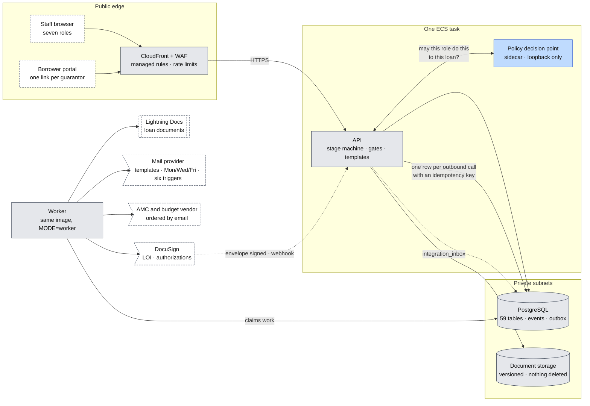
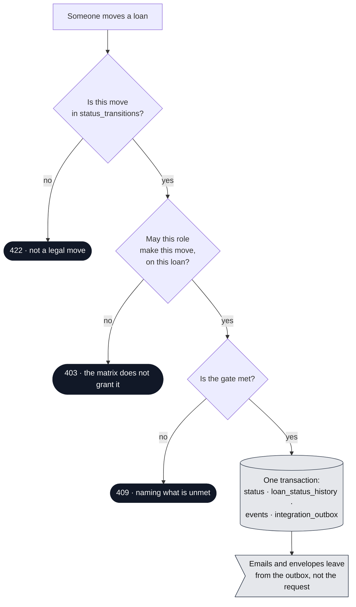

# System design

**What this is.** How the application itself is built — the pieces inside the
container, how a request is decided, how the stage machine is enforced, and how
work reaches DocuSign, Lightning Docs and the mail provider. Written against the
process in `01-the-process.md`, the roles in `05-roles.md` and the schema in
`08-database.md`. Every choice below exists because something in that record
needs it.

**What this is not.** Hosting — that is `09-architecture-and-hosting.md`. The
data — that is `08-database.md`. The process — that is `01-the-process.md` and
`02-the-flowchart.md`. No sizing, no estimate, no commercial terms, in keeping
with the rest of this folder.

**One section is a proposal, not a record.** The permission engine in Part 3 is
an engineering recommendation about *what enforces* the matrix. The matrix
itself is the client's, and it is still owed — Dan has the roles list and the
view/update matrix outstanding, and nothing in Part 3 starts before that
arrives. The proposal is logged as an open question rather than asserted as
settled.

---

## Part 1 · The shape

One container image, run two ways. As `api` it serves the platform and the
borrower portal; as `worker` it drains `integration_outbox` and the queue.
Alongside the API in the same task sits the policy decision point — a second
container that answers "may this person do this to this loan", and nothing else.



**The rule that shapes everything else:** a request touches PostgreSQL and the
policy engine, and nothing else. Every call to the outside world — a DocuSign
envelope, a Lightning Docs generation, a kick-off email, an AMC order — is a row
in `integration_outbox` written inside the same transaction as the thing that
caused it, and sent later by the worker. That is what makes a retry safe and an
outage survivable, and it is why the LOI can never go out twice.

| Piece | What it owns | Why it is separate |
|---|---|---|
| **API** | Stage and status transitions, the four gates, needs-list generation from permutations, document review layers, template rendering, portal links | The only writer of business state |
| **Policy decision point** | One question: may this principal take this action on this loan | Loopback call inside the task — no network hop, no second database, no shared state. Part 3 |
| **Worker** | `integration_outbox` relay, the queue, retries, the dead-letter queue, the Mon/Wed/Fri schedule and the six vendor triggers | A slow vendor must never slow a screen |
| **PostgreSQL** | Every fact, plus the gates as constraints and the audit trail as `events` | The process is enforced here as well as in the API, so a bug in one layer is not a breach of the process |
| **Document storage** | The files. Append and replace both keep the predecessor | Nothing is ever deleted — the three-months-of-bank-statements case in Stage 3 |

---

## Part 2 · The stage machine

`stages`, `statuses` and `status_transitions` are data, not code. A status moves
only through `POST /loans/{id}/status`, and that call is checked three times: the
policy engine decides whether this role may make this move, the API evaluates the
gate, and a database trigger refuses a pair that is not in `status_transitions`.
The canonical status list lives in `01-the-process.md` and `02-the-flowchart.md`;
this section is about what enforces it.



**The four gates already settled, and where each is enforced.** All four appear
in `05-roles.md` as rules the system refuses to break; this is the mechanism.

| Gate | Rule | API | Database |
|---|---|---|---|
| **The Processing gate** | The loan enters Processing only when the four conditions hold | `409`, naming what is unmet | Trigger on the transition; the conditions are columns, not inference |
| **Open findings** | Nothing approves in Internal or Investor Review while a finding is open | `409` | Trigger reads `findings` — a direct write cannot slip past it |
| **Needs-list removal** | Only Credit removes an item. A client manager emails Credit; there is deliberately no button | `403` | Grant on the delete path |
| **No Fly** | LOI generation is blocked until an override is recorded | `403`, pointing at the match | `no_fly_matches` without an `no_fly_overrides` row blocks generation |

**Two properties worth stating plainly.** *Idempotency:* generation, transitions
and sends carry a key, so a double-click or a retried request produces one LOI,
one envelope, one email. *Correlation:* the id on the request is written to
`events`, so one action can be traced from the click to the envelope.

**On-Hold sits across every stage** rather than inside the sequence, and carries
its own permission rule — which is one more reason the permission question in
Part 3 is not answerable by a role column alone.

---

## Part 3 · Permissions — the matrix, and what enforces it

**The record.** `roles.permissions` holds the matrix as `jsonb` — surface →
read / edit / act — in one place, and the API refuses what it does not grant.
`05-roles.md` fills that matrix in for seven roles across thirteen surfaces, and
Jonathan settled the shape of the question on 2026-08-06: *"what you see under
those tabs depends, one, on the phase it's in, and then two would be your user
role."* Phase gating is in `07-data-fields.md`; the role half is the matrix.

**The gap.** Phase and role are two axes, and the matrix has one. Five of the
rules already written down are not "surface → read/edit/act" at all:

| Rule from `05-roles.md` | What it actually depends on |
|---|---|
| Loan Officer and Client Management see **own loans**; Credit and Admin see **all** | Who the loan is assigned to — a fact about the row, not the surface |
| Third-Party Review and Internal Underwrite see **queue only** | Whether the loan is in their queue right now |
| Closing sees **approved only** | The loan's stage |
| Nothing approves while a finding is open | Live state on another table |
| Lightning Docs and post-funding fields belong to Closing | Stage and role together |

Rules of that shape are attribute-based. They can be hand-written in each
handler — which is what a matrix in a column implies — or they can be written
once as policy and evaluated by an engine. The difference shows up most on the
**Loans list**: "own loans", "queue only" and "approved only" are not decisions
about one row, they are a filter on every query, and a filter written by hand in
each endpoint is the thing that drifts from the matrix first.

### The recommendation

**Keep the matrix as the client's source of coarse grants, and evaluate it with
a policy engine running as a sidecar.** The matrix stays where it is and stays
theirs; the engine holds the conditional half — ownership, queue, stage, open
findings, No Fly, On-Hold — as policy files that live in the repository, are
tested in CI, and are reviewed like code.

Why a sidecar rather than a service or a hosted API: it answers on loopback, so
a decision costs no network hop; it holds no state, so there is no second
database to keep in step with the loan record; and it can compile the same
policy into a SQL predicate, which is what makes the Loans list rows and the
matrix stay honest with each other.

| Option | Fits the five conditional rules | Filters the Loans list | Runtime it adds |
|---|---|---|---|
| **Matrix in `roles.permissions`, checks by hand** | The surface half only; the rest lands in handlers | Written per endpoint, by hand | None — and no way to test the rules as a set |
| **Policy engine as a sidecar** — recommended | Yes, as conditions over the loan's own attributes | One plan, compiled to a `WHERE` clause | A second container in the same task |
| **Hosted policy API** | Yes | No — list filtering is not offered; the hand-written filters come back | A metered call on every decision |
| **Relationship engine** (Zanzibar-style) | Awkward — stage and findings are not graph edges | By identifier lookup, then `IN (…)` | A service *and* a store that must mirror the loan record |

The recommended shape, in the vocabulary of this folder:

```yaml
# derived roles — who this person is *to this loan*
- name: owner_lo          # Loan Officer, own loans
  parentRoles: [loan_officer]
  condition: { match: { expr: "request.resource.attr.lo_id == request.principal.id" } }
- name: assigned_cm       # Client Management, own loans
  parentRoles: [client_management]
  condition: { match: { expr: "request.resource.attr.cm_id == request.principal.id" } }
- name: in_my_queue       # Third-Party Review, Internal Underwrite
  parentRoles: [third_party_review, internal_underwrite]
  condition: { match: { expr: "request.principal.id in request.resource.attr.queue_user_ids" } }

# the rules themselves
- actions: [approve_review]
  roles: [internal_underwrite, admin]
  condition:
    match:
      all:
        of:
          - expr: "request.resource.attr.findings_open == 0"       # 409 otherwise
          - expr: "request.resource.attr.stage in ['internal_review','investor_review']"
- actions: [remove_needs_item]
  roles: [credit, admin]                                            # CM gets 403, by design
- actions: [generate_loi]
  roles: [credit, admin]
  condition:
    match:
      expr: "!request.resource.attr.no_fly_match || request.resource.attr.no_fly_override"
```

**What it does not change.** The database keeps its triggers. A policy engine
decides what a request may do; the constraints in `08-database.md` decide what
the data may become. The Processing gate, the open-finding rule and the No Fly
block stay enforced in both places, because one of them is the process and the
other is a program.

**What it would cost the team.** Policy files are a new thing to learn — YAML
and a small expression language, not a general-purpose language. The engine only
knows the attributes it is handed, so the loan projection passed to it (`lo_id`,
`cm_id`, `queue_user_ids`, `stage`, `findings_open`, `no_fly_match`,
`no_fly_override`, `on_hold`) becomes a contract worth testing. And the query
plan it returns has to be translated to SQL once, in one adapter, with its own
tests.

**Where this stands:** a proposal, entered as an open question. The matrix is
owed by Dan and nothing here starts before it. The known gap F4 — role filtering
of *fields* not yet applied across the tabs — is the same question one level
down, and the same engine answers it if the answer is yes.

---

## Part 4 · The API surface

Conventions first, because they are what the rules above rely on.

| Convention | Detail |
|---|---|
| **Shape** | JSON over HTTPS, versioned, one route group per surface in `05-roles.md` |
| **Correlation** | Every request carries an id; it is written to `events` and returned on errors, so one action traces end to end |
| **Idempotency** | Required on generation, sends and transitions. Same key, same result — never a second LOI |
| **Errors** | `400` validation · `403` the matrix does not grant it · `404` for a loan the caller may not see, so existence is not leaked · `409` a gate is unmet, naming it · `422` not a legal transition |
| **Concurrency** | Version on the loan; a stale update is refused rather than silently overwriting a colleague |

| Group | Covers |
|---|---|
| **Loans** | The nine tabs, phase- and role-filtered; status transitions; assignment; On-Hold |
| **Needs list** | Generation from permutations; add (Credit and CM); remove (Credit only); follow-up questions attached under their item |
| **Documents** | Upload, append or replace, the three review layers, package routing, prior-evidence history |
| **Reviews** | Findings raised, cleared with a note, sent back; internal and investor |
| **Communications** | Templates, manual and composed modes, cc/bcc, threads, the Mon/Wed/Fri status email and the six vendor triggers |
| **Closing** | Lightning Docs fields, the five statuses, wire reference, funding date, servicing tape |
| **Portal** | One link per guarantor; their items only; internal documents never appear |
| **Reporting** | Pulse, Outstanding Item by Loan, Appraisal, Budget, IC Summary — served from the read replica |

---

## Part 5 · Work that leaves the platform

Everything outbound is a row in `integration_outbox` with an idempotency key,
claimed by the worker, retried on a controlled policy, dead-lettered when it
keeps failing. Everything inbound is stored in `integration_inbox` before it is
acted on, so a replayed webhook is a no-op and a missed one can be reconciled.

| Work | Trigger in the process | Notes |
|---|---|---|
| **DocuSign envelopes** | LOI package; one authorization per guarantor 2+ | Signed status and date come back by webhook into `integration_inbox` |
| **Lightning Docs generation** | Docs Approved | Fields are Closing's; the output is captured as a generated document |
| **Kick-off email** | LOI signed → Pre-Processing | Carries the needs list |
| **Status email** | Monday, Wednesday, Friday | A schedule, not an SLA — there are none |
| **Six vendor triggers** | Appraisal and budget events | Each fires once per loan and records that it did |
| **AMC and budget orders** | Ordered by email; no API integration in this phase | The system records the order and the dates, and chases |
| **Tapes** | Investor tape at review; servicing tape after funding | The servicing tape cannot be generated before the loan is funded |

**Reconciliation, nightly.** Anything still in flight past its expected point —
an envelope sent but not returned, a generation started but not finished — is
re-queried rather than assumed. A missed webhook should cost a night, not a loan.

---

## Part 6 · Environments and delivery

- **Three environments**, isolated from each other. The client's data exists in
  one of them.
- **One image, two modes.** `api` and `worker` are the same build; there is no
  second codebase to keep in step.
- **Migrations run before the new image serves traffic**, and are backward
  compatible for one release, so a rollback does not strand the database.
- **The pipeline gates on tests, and on the policy tests** — "a CM cannot remove
  a needs-list item", "nothing approves while a finding is open" are assertions
  that run on every commit, not conventions.
- **Outside parties have fakes.** DocuSign, Lightning Docs and the mail provider
  each have a stand-in used in development and in the test suite, so the process
  can be exercised end to end without touching a vendor.

---

## What this document does not settle

| | Where it lives |
|---|---|
| The permission matrix itself — owed by Dan, and nothing in Part 3 starts before it | `00-what-we-are-building.md` Part 4 |
| Whether a policy engine is adopted at all, or the matrix is enforced by hand | **New — raised by this document** |
| Field-level role filtering across the tabs (QA finding F4) | `05-roles.md` |
| Whether Management becomes an eighth role (Q-013) | `11-open-questions.md` |
| How documents actually reach Setpoint — the routing is recorded, not transmitted | `01-the-process.md` Stage 3 |
| Sizing, budget and anything commercial | Deliberately absent from this folder |
